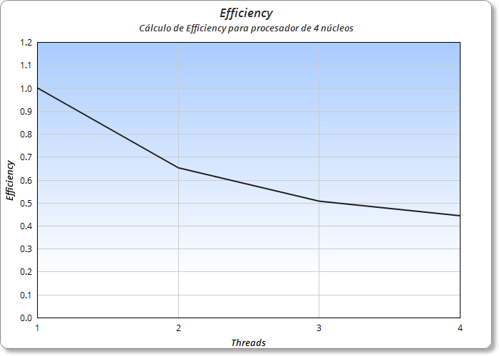
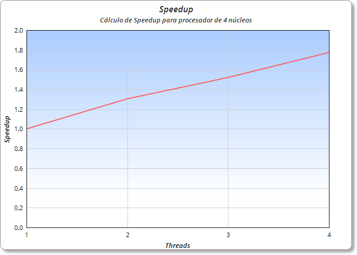

# Multi-Thread-Sudoku

> Speedup and Efficiency calculation to Sudoku NxN solver

## Objective 

The objective is to obtain the Speedup and the Efficiency, 
executing the code from 1 to N threads according to the amount 
of cores presents in the executing pc. Analyze graphs of the 
results to classify the algorithm.

## Details and Observations

* For each amount of Threads, 120 tests were made, from these the 10 largest and 10 smallest were removed to try to prevent a drop in the average.
* The results are from a 9x9 sudoku and the algorithm works to solve for 9 quadrants. 
* Considere an Intel processor with 2 principal cores using Hyperthreading, 4 cores in total.
* Tests were also carried out for 32 cores to see how the results varied, but they went down or up in chaotic results.
* If there are some other elements it is because I tried to make the code with the CSP algorithm, but I could not represent it correctly.

## All Data Obtained 

| Threads | Time (nanoseconds) | Speedup | Efficiency |
| --- | --- | --- | --- |
| 1   | 1027901 | 1.0     | 1.0     |
| 2   | 787924  | 1.3045  | 0.6522  |
| 3   | 675942  | 1.5206  | 0.5068  |
| 4   | 579548  | 1.7736  | 0.4434  |

## Efficiency Graph

 

## Speedup Graph

 

## License

This project is open-sourced software licensed under the [MIT License](https://opensource.org/licenses/MIT)

## Contact

Created by Computer Engineer [Charlie Condorcet](https://github.com/charliecondorcet)	-	<ccm059@alumnos.ucn.cl>